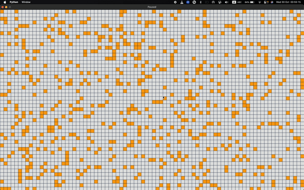

# Pygame Grid Simulation

An interactive grid simulation using Pygame where cells evolve based on neighbor rules. Create, clear, or randomly generate patterns and watch them change over time.

## Features

- **Interactive Grid**: Click to add/remove cells.
- **Controls**:
  - **Space**: Start/Pause
  - **C**: Clear grid
  - **G**: Random pattern generation
- **Evolution Rules**:
  - Cells with 2-3 neighbors survive.
  - Dead cells with exactly 3 neighbors become alive.

## Setup

1. Install Pygame:
   ```bash
   pip install pygame
    ```
2. Run the program:
    ```bash
    python main.py
    ```
## Demo

